# 交易所

```solidity
pragma solidity ^0.8.24;
// SPDX-License-Identifier: UNLICENSED

import "@openzeppelin/contracts/token/ERC721/IERC721.sol";
import "@openzeppelin/contracts/token/ERC721/IERC721Receiver.sol";

/**
卖家：出售 NFT 的一方，可以挂单 list、撤单 revoke、修改价格 update。
买家：购买 NFT 的一方，可以购买 purchase。
订单：卖家发布的 NFT 链上订单，一个系列的同一 tokenId 最多存在一个订单，其中包含挂单价格 price 和持有人 owner 信息。当一个订单交易完成或被撤单后，其中信息清零。
*/

contract NFTSwap is IERC721Receiver{

    //订单，其中包含挂单价格 price 和持有人 owner 信息
    struct Order {
        address owner;
        uint256 price;
    }

    //ntf地址 =》（tokenid => order)
    mapping(address => mapping(uint256 => Order)) public  nftList;

    event List(address indexed seller, address indexed nftAddr, uint256 indexed tokenId, uint256 price);
    event Purchase(address indexed buyer, address indexed nftAddr, uint256 indexed tokenId, uint256 price);
    event Revoke(address indexed seller, address indexed nftAddr, uint256 indexed tokenId);    
    event Update(address indexed seller, address indexed nftAddr, uint256 indexed tokenId, uint256 newPrice);

    modifier priceGT0 (uint256 price) {
        require(price > 0,"price must great than 0");
        _;
    }

    modifier isOwnedToken(address _nftAddress,uint256 tokenId) {
        require(nftList[_nftAddress][tokenId].owner == msg.sender,"not your order");
        _;
    }

    modifier isInContract(address _nftAddress,uint256 tokenId) {
        require(IERC721(_nftAddress).ownerOf(tokenId) == address(this),"not in contract");
        _;
    }


    // 实现{IERC721Receiver}的onERC721Received，能够接收ERC721代币
    function onERC721Received(address operator,address from,uint tokenId,bytes calldata data) external override pure returns(bytes4){
        return IERC721Receiver.onERC721Received.selector;
    }

    //出售 NFT 的一方，可以挂单 list
    //需要挂单 首先需要传入 代币地址，tokenid 和价格 ，还需要判断是否获得approve
    function list(address _nftAddress,uint256 tokenId, uint256 price) public priceGT0(price) { 
        IERC721 nft = IERC721(_nftAddress);
        //根据tokenid 获得的地址是否等于该合约的地址 来判断是否授权
        require(nft.getApproved(tokenId) == address(this),"not approved");
        //价格必须大于0

        // 将NFT转账到合约
        nft.safeTransferFrom(msg.sender,address(this),tokenId);

        //设置order
        Order storage order = nftList[_nftAddress][tokenId];
        order.owner = msg.sender;
        order.price = price;
        emit List(msg.sender, _nftAddress, tokenId, price);
    }

    //修改订单
    //首先需要传入 代币地址，tokenid 和价格
    //只能修改自己的
    //必须以及转移到了合约
    function update(address _nftAddress,uint256 tokenId, uint256 price) public priceGT0(price) isOwnedToken(_nftAddress, tokenId) isInContract(_nftAddress,tokenId) { 
        Order storage order = nftList[_nftAddress][tokenId];
        order.price = price;

        emit Update(msg.sender, _nftAddress, tokenId, price);

     }

     //撤销订单
     //首先需要传入 代币地址，tokenid 
     //必须还在合约
     //只能撤销自己的
    function revoke(address _nftAddress,uint256 tokenId) public isInContract(_nftAddress,tokenId) isOwnedToken(_nftAddress, tokenId)  { 
        delete nftList[_nftAddress][tokenId];

        //转移到卖家手里
        IERC721 nft = IERC721(_nftAddress);
        nft.safeTransferFrom(address(this),msg.sender,tokenId);

        emit Revoke(msg.sender, _nftAddress, tokenId);
       
     }

     //买家购买
     //首先需要传入 代币地址，tokenid 
     //必须还在合约
     function purchase(address _nftAddress,uint256 tokenId) public  isInContract(_nftAddress,tokenId) {
        Order storage order = nftList[_nftAddress][tokenId];
        //价格必须到位
        require(msg.value >= order.price);
        
        //转移到购买人地址
        IERC721 nft = IERC721(_nftAddress);
        nft.safeTransferFrom(address(this),msg.sender,tokenId);
        
        //删除order
        delete nftList[_nftAddr][_tokenId];

        //打钱
        payable(order.owner).transfer(order.price);
        //找钱
        payable(msg.sender).transfer(msg.value-order.price);
        
     }

}
```


造币合约

```solidity
pragma solidity ^0.8.24;
// SPDX-License-Identifier: UNLICENSED

import "@openzeppelin/contracts/token/ERC721/ERC721.sol";
contract DogNFT is ERC721{
    uint public MAX_APES = 10000; // 总量

    // 构造函数
    constructor(string memory name_, string memory symbol_) ERC721(name_, symbol_){
    }

    //BAYC的baseURI为ipfs://QmeSjSinHpPnmXmspMjwiXyN6zS4E9zccariGR3jxcaWtq/ 
    function _baseURI() internal pure override returns (string memory) {
        return "ipfs://QmeSjSinHpPnmXmspMjwiXyN6zS4E9zccariGR3jxcaWtq/";
    }
    
    // 铸造函数
    function mint(address to, uint tokenId) external {
        require(tokenId >= 0 && tokenId < MAX_APES, "tokenId out of range");
        _mint(to, tokenId);
    }
}
```


先部署自己的代币

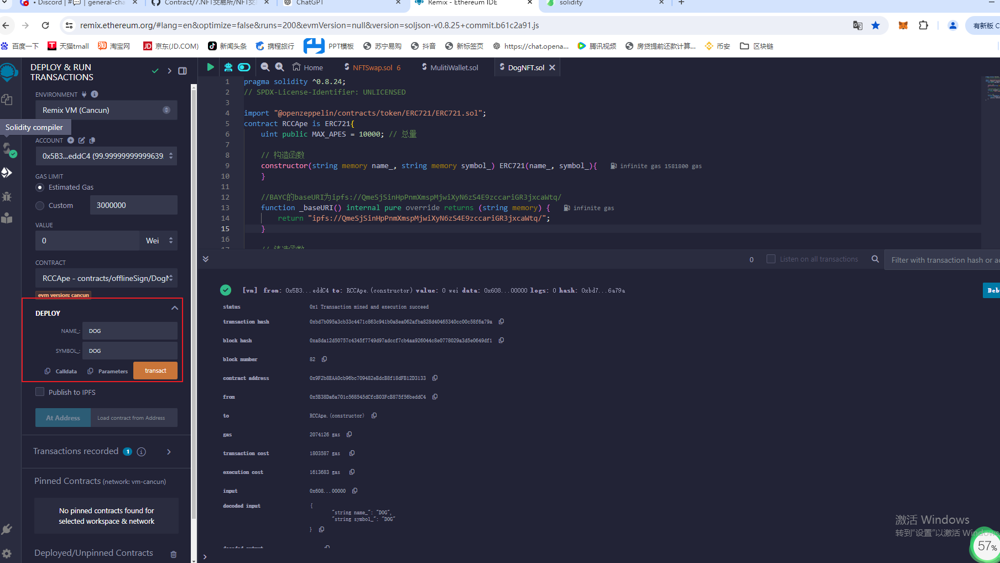

```
status	0x1 Transaction mined and execution succeed
transaction hash	0xbd7b095a3cb33c4471c863c941b0a8ea062afba828d40465340cc00c58f6a79a
block hash	0xa8da12d50757c4345f7749d97adccf7cb4aa926044c8e0778029a3d5e0649df1
block number	82
contract address	0x9F2b8EAA0cb96bc709482eBdcB8f18dFB12D3133
from	0x5B38Da6a701c568545dCfcB03FcB875f56beddC4
to	RCCApe.(constructor)
gas	2074126 gas
transaction cost	1803587 gas 
execution cost	1613683 gas 
input	0x608...00000
decoded input	{
	"string name_": "DOG",
	"string symbol_": "DOG"
}
decoded output	 - 
logs	[]
```

mint  给自己 两个token
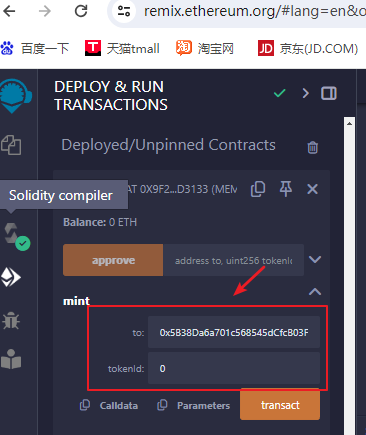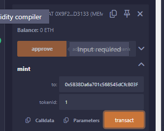

```
status	0x1 Transaction mined and execution succeed
transaction hash	0x678cbbeca04bee58ad5cddeb551169a7537f041d411932b3925b80057020f7a0
block hash	0xd7151e90ee2a1db37489e35b785ff344748d4bb2e755e4ad227881fbe258838f
block number	83
from	0x5B38Da6a701c568545dCfcB03FcB875f56beddC4
to	RCCApe.mint(address,uint256) 0x9F2b8EAA0cb96bc709482eBdcB8f18dFB12D3133
gas	82020 gas
transaction cost	71321 gas 
execution cost	49761 gas 
input	0x40c...00000
decoded input	{
	"address to": "0x5B38Da6a701c568545dCfcB03FcB875f56beddC4",
	"uint256 tokenId": "0"
}
decoded output	{}
logs	[
	{
		"from": "0x9F2b8EAA0cb96bc709482eBdcB8f18dFB12D3133",
		"topic": "0xddf252ad1be2c89b69c2b068fc378daa952ba7f163c4a11628f55a4df523b3ef",
		"event": "Transfer",
		"args": {
			"0": "0x0000000000000000000000000000000000000000",
			"1": "0x5B38Da6a701c568545dCfcB03FcB875f56beddC4",
			"2": "0",
			"from": "0x0000000000000000000000000000000000000000",
			"to": "0x5B38Da6a701c568545dCfcB03FcB875f56beddC4",
			"tokenId": "0"
		}
	}
]


status	0x1 Transaction mined and execution succeed
transaction hash	0xb6c84b059816a62b75c1cd1199cffe771d028fda01c7c7dcf00f78901be43aae
block hash	0x3d84d8a97988b777721995e1c89242850ef8babe3cabbfea217b27bcae393744
block number	84
from	0x5B38Da6a701c568545dCfcB03FcB875f56beddC4
to	RCCApe.mint(address,uint256) 0x9F2b8EAA0cb96bc709482eBdcB8f18dFB12D3133
gas	62368 gas
transaction cost	54233 gas 
execution cost	32661 gas 
input	0x40c...00001
decoded input	{
	"address to": "0x5B38Da6a701c568545dCfcB03FcB875f56beddC4",
	"uint256 tokenId": "1"
}
decoded output	{}
logs	[
	{
		"from": "0x9F2b8EAA0cb96bc709482eBdcB8f18dFB12D3133",
		"topic": "0xddf252ad1be2c89b69c2b068fc378daa952ba7f163c4a11628f55a4df523b3ef",
		"event": "Transfer",
		"args": {
			"0": "0x0000000000000000000000000000000000000000",
			"1": "0x5B38Da6a701c568545dCfcB03FcB875f56beddC4",
			"2": "1",
			"from": "0x0000000000000000000000000000000000000000",
			"to": "0x5B38Da6a701c568545dCfcB03FcB875f56beddC4",
			"tokenId": "1"
		}
	}
]

```


部署交易所合约

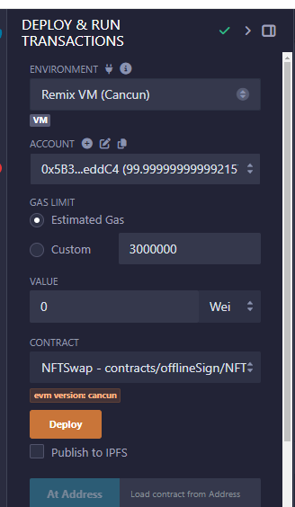

```
status	0x1 Transaction mined and execution succeed
transaction hash	0x39c69927709d725dfa661fe6951e4173e43b142af9b687b4ea4644a818380002
block hash	0x35b09458e262be9bda0985fb67a19c498be58aa6da957de6ba8306f01b17fa45
block number	89
contract address	0x19a0870a66B305BE9917c0F14811C970De18E6fC
from	0x5B38Da6a701c568545dCfcB03FcB875f56beddC4
to	NFTSwap.(constructor)
gas	216945 gas
transaction cost	188647 gas 
execution cost	125769 gas 
input	0x608...90033
decoded input	{}
decoded output	 - 
logs	[]
```


在 `DogNFT` 合约中调用 `approve()` 授权函数，将自己持有的 `tokenId` 为 0 的 NFT 授权给 `NFTSwap` 合约地址。

`approve(address to, uint tokenId)` 方法有 2 个参数:

`to`: 将 tokenId 授权给 `to` 地址，本案例中将授权给 `NFTSwap` 合约地址。

`tokenId`: `tokenId` 为 NFT 的 id，本案例中为上述 mint 的 `0` Id。

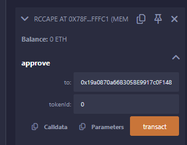

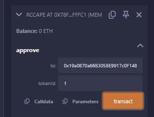

```
status	0x1 Transaction mined and execution succeed
transaction hash	0x8af4615b3239ac3ecfbd617881dbc49828b325fcd836d2f64f016b4889dccab0
block hash	0x472ca51a80935cbd429846c00194405b4b4f0d079313d0814b3866cfd86d8826
block number	90
from	0x5B38Da6a701c568545dCfcB03FcB875f56beddC4
to	RCCApe.approve(address,uint256) 0x78FD83768c7492aE537924c9658BE3D29D8ffFc1
gas	56352 gas
transaction cost	49001 gas 
execution cost	27441 gas 
input	0x095...00000
decoded input	{
	"address to": "0x19a0870a66B305BE9917c0F14811C970De18E6fC",
	"uint256 tokenId": "0"
}
decoded output	{}
logs	[
	{
		"from": "0x78FD83768c7492aE537924c9658BE3D29D8ffFc1",
		"topic": "0x8c5be1e5ebec7d5bd14f71427d1e84f3dd0314c0f7b2291e5b200ac8c7c3b925",
		"event": "Approval",
		"args": {
			"0": "0x5B38Da6a701c568545dCfcB03FcB875f56beddC4",
			"1": "0x19a0870a66B305BE9917c0F14811C970De18E6fC",
			"2": "0",
			"owner": "0x5B38Da6a701c568545dCfcB03FcB875f56beddC4",
			"approved": "0x19a0870a66B305BE9917c0F14811C970De18E6fC",
			"tokenId": "0"
		}
	}
]

status	0x1 Transaction mined and execution succeed
transaction hash	0x7da8063a6c8539feff1b5980e9b5555cc839f34adfe759c2f36b017f881663f0
block hash	0x22c7f6bfde10dde8aa165ecb7857eaccbc54c5585e313994b19530543152eb38
block number	91
from	0x5B38Da6a701c568545dCfcB03FcB875f56beddC4
to	RCCApe.approve(address,uint256) 0x78FD83768c7492aE537924c9658BE3D29D8ffFc1
gas	56365 gas
transaction cost	49013 gas 
execution cost	27441 gas 
input	0x095...00001
decoded input	{
	"address to": "0x19a0870a66B305BE9917c0F14811C970De18E6fC",
	"uint256 tokenId": "1"
}
decoded output	{}
logs	[
	{
		"from": "0x78FD83768c7492aE537924c9658BE3D29D8ffFc1",
		"topic": "0x8c5be1e5ebec7d5bd14f71427d1e84f3dd0314c0f7b2291e5b200ac8c7c3b925",
		"event": "Approval",
		"args": {
			"0": "0x5B38Da6a701c568545dCfcB03FcB875f56beddC4",
			"1": "0x19a0870a66B305BE9917c0F14811C970De18E6fC",
			"2": "1",
			"owner": "0x5B38Da6a701c568545dCfcB03FcB875f56beddC4",
			"approved": "0x19a0870a66B305BE9917c0F14811C970De18E6fC",
			"tokenId": "1"
		}
	}
]

```

1. **上架NFT**

调用 `NFTSwap` 合约的 `list()` 函数，将自己持有的 `tokenId` 为 0 的 NFT 上架到 `NFTSwap`，价格设为 1 `wei`。

`list(address _nftAddr, uint256 _tokenId, uint256 _price)` 方法有 3 个参数:

`_nftAddr`: `_nftAddr` 为 NFT 合约地址，本案例中为 `RCCApe` 合约地址。

`_tokenId`: `_tokenId` 为 NFT 的 id，本案例中为上述 mint 的 `0` Id。

`_price`: `_price` 为 NFT 的价格，本案例中为 1 `wei`。

按照上述方法，同理将自己持有的 `tokenId` 为 1 的 NFT 上架到 `NFTSwap`，价格设为 1 `wei`。


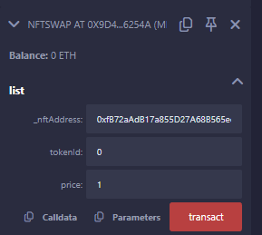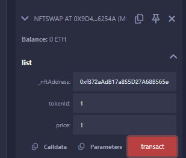

```
status	0x1 Transaction mined and execution succeed
transaction hash	0x5fe14414134f927210368f7577b6cab50d252eebe794cf06e163ee517605db93
block hash	0x41cb7062228d01f101c2ffab5875a669cd5f68c07c3ed53c402a21edb6c56628
block number	105
from	0x5B38Da6a701c568545dCfcB03FcB875f56beddC4
to	NFTSwap.list(address,uint256,uint256) 0x9D437a1Da98559542f1F3b457B94560c0446254A
gas	145343 gas
transaction cost	116785 gas 
execution cost	99885 gas 
input	0xdda...00001
decoded input	{
	"address _nftAddress": "0xfB72aAdB17a855D27A68B565ee0a84CB30A387e4",
	"uint256 tokenId": "0",
	"uint256 price": "1"
}
decoded output	{}
logs	[
	{
		"from": "0xfB72aAdB17a855D27A68B565ee0a84CB30A387e4",
		"topic": "0xddf252ad1be2c89b69c2b068fc378daa952ba7f163c4a11628f55a4df523b3ef",
		"event": "Transfer",
		"args": {
			"0": "0x5B38Da6a701c568545dCfcB03FcB875f56beddC4",
			"1": "0x9D437a1Da98559542f1F3b457B94560c0446254A",
			"2": "0",
			"from": "0x5B38Da6a701c568545dCfcB03FcB875f56beddC4",
			"to": "0x9D437a1Da98559542f1F3b457B94560c0446254A",
			"tokenId": "0"
		}
	},
	{
		"from": "0x9D437a1Da98559542f1F3b457B94560c0446254A",
		"topic": "0xedbdf022944a3291f4b30148903a84720506f48e10478ec5812e5caf30e1fab0",
		"event": "List",
		"args": {
			"0": "0x5B38Da6a701c568545dCfcB03FcB875f56beddC4",
			"1": "0xfB72aAdB17a855D27A68B565ee0a84CB30A387e4",
			"2": "0",
			"3": "1",
			"seller": "0x5B38Da6a701c568545dCfcB03FcB875f56beddC4",
			"nftAddr": "0xfB72aAdB17a855D27A68B565ee0a84CB30A387e4",
			"tokenId": "0",
			"price": "1"
		}
	}
]


status	0x1 Transaction mined and execution succeed
transaction hash	0x7ecf66fcacb9d9d9a76a248e5d3c074399310fa15a1d0420c6b1d5eb2946761b
block hash	0xaf3e82a5720ad14345a858ae7ec51c19d6491e751bea5411829efd9bae4ae7d4
block number	106
from	0x5B38Da6a701c568545dCfcB03FcB875f56beddC4
to	NFTSwap.list(address,uint256,uint256) 0x9D437a1Da98559542f1F3b457B94560c0446254A
gas	131212 gas
transaction cost	94897 gas 
execution cost	82785 gas 
input	0xdda...00001
decoded input	{
	"address _nftAddress": "0xfB72aAdB17a855D27A68B565ee0a84CB30A387e4",
	"uint256 tokenId": "1",
	"uint256 price": "1"
}
decoded output	{}
logs	[
	{
		"from": "0xfB72aAdB17a855D27A68B565ee0a84CB30A387e4",
		"topic": "0xddf252ad1be2c89b69c2b068fc378daa952ba7f163c4a11628f55a4df523b3ef",
		"event": "Transfer",
		"args": {
			"0": "0x5B38Da6a701c568545dCfcB03FcB875f56beddC4",
			"1": "0x9D437a1Da98559542f1F3b457B94560c0446254A",
			"2": "1",
			"from": "0x5B38Da6a701c568545dCfcB03FcB875f56beddC4",
			"to": "0x9D437a1Da98559542f1F3b457B94560c0446254A",
			"tokenId": "1"
		}
	},
	{
		"from": "0x9D437a1Da98559542f1F3b457B94560c0446254A",
		"topic": "0xedbdf022944a3291f4b30148903a84720506f48e10478ec5812e5caf30e1fab0",
		"event": "List",
		"args": {
			"0": "0x5B38Da6a701c568545dCfcB03FcB875f56beddC4",
			"1": "0xfB72aAdB17a855D27A68B565ee0a84CB30A387e4",
			"2": "1",
			"3": "1",
			"seller": "0x5B38Da6a701c568545dCfcB03FcB875f56beddC4",
			"nftAddr": "0xfB72aAdB17a855D27A68B565ee0a84CB30A387e4",
			"tokenId": "1",
			"price": "1"
		}
	}
]
```

查看

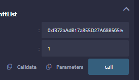

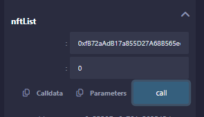

```

from	0x5B38Da6a701c568545dCfcB03FcB875f56beddC4
to	NFTSwap.nftList(address,uint256) 0x9D437a1Da98559542f1F3b457B94560c0446254A
execution cost	5362 gas (Cost only applies when called by a contract)
input	0xba5...00001
decoded input	{
	"address ": "0xfB72aAdB17a855D27A68B565ee0a84CB30A387e4",
	"uint256 ": "1"
}
decoded output	{
	"0": "address: owner 0x5B38Da6a701c568545dCfcB03FcB875f56beddC4",
	"1": "uint256: price 1"
}
logs	[]


from	0x5B38Da6a701c568545dCfcB03FcB875f56beddC4
to	NFTSwap.nftList(address,uint256) 0x9D437a1Da98559542f1F3b457B94560c0446254A
execution cost	5362 gas (Cost only applies when called by a contract)
input	0xba5...00000
decoded input	{
	"address ": "0xfB72aAdB17a855D27A68B565ee0a84CB30A387e4",
	"uint256 ": "0"
}
decoded output	{
	"0": "address: owner 0x5B38Da6a701c568545dCfcB03FcB875f56beddC4",
	"1": "uint256: price 1"
}
logs	[]
```


update

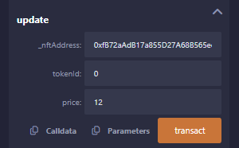

```

status	0x1 Transaction mined and execution succeed
transaction hash	0x817b70a59e6de1702b96418f1a89bae35ef9cf2604bfde676c4742c167af1da8
block hash	0xa5e522542dbd3ebcab4205392d773bcd84e893e559d89944da21e2737555c7c7
block number	111
from	0x5B38Da6a701c568545dCfcB03FcB875f56beddC4
to	NFTSwap.update(address,uint256,uint256) 0x9D437a1Da98559542f1F3b457B94560c0446254A
gas	44473 gas
transaction cost	38672 gas 
execution cost	16972 gas 
input	0xd09...0000c
decoded input	{
	"address _nftAddress": "0xfB72aAdB17a855D27A68B565ee0a84CB30A387e4",
	"uint256 tokenId": "0",
	"uint256 price": "12"
}
decoded output	{}
logs	[
	{
		"from": "0x9D437a1Da98559542f1F3b457B94560c0446254A",
		"topic": "0xb7f0ca7cd5b24651672216886135b99ff40342bcf549009a4c6fc74f059fb9a0",
		"event": "Update",
		"args": {
			"0": "0x5B38Da6a701c568545dCfcB03FcB875f56beddC4",
			"1": "0xfB72aAdB17a855D27A68B565ee0a84CB30A387e4",
			"2": "0",
			"3": "12",
			"seller": "0x5B38Da6a701c568545dCfcB03FcB875f56beddC4",
			"nftAddr": "0xfB72aAdB17a855D27A68B565ee0a84CB30A387e4",
			"tokenId": "0",
			"newPrice": "12"
		}
	}
]
```


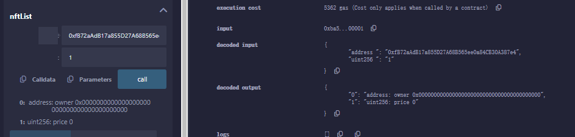reovke
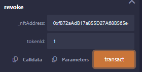

```

status	0x1 Transaction mined and execution succeed
transaction hash	0xd0e93888a1a119acf0819aca9acf3612e51e205a73652c7693a85fc396644e98
block hash	0xb38794f3e118ccc3331bff1b523a8ca74bbd7f048c0fcf45e2332d1e7c941291
block number	112
from	0x5B38Da6a701c568545dCfcB03FcB875f56beddC4
to	NFTSwap.revoke(address,uint256) 0x9D437a1Da98559542f1F3b457B94560c0446254A
gas	101465 gas
transaction cost	69030 gas 
execution cost	57058 gas 
input	0xeac...00001
decoded input	{
	"address _nftAddress": "0xfB72aAdB17a855D27A68B565ee0a84CB30A387e4",
	"uint256 tokenId": "1"
}
decoded output	{}
logs	[
	{
		"from": "0xfB72aAdB17a855D27A68B565ee0a84CB30A387e4",
		"topic": "0xddf252ad1be2c89b69c2b068fc378daa952ba7f163c4a11628f55a4df523b3ef",
		"event": "Transfer",
		"args": {
			"0": "0x9D437a1Da98559542f1F3b457B94560c0446254A",
			"1": "0x5B38Da6a701c568545dCfcB03FcB875f56beddC4",
			"2": "1",
			"from": "0x9D437a1Da98559542f1F3b457B94560c0446254A",
			"to": "0x5B38Da6a701c568545dCfcB03FcB875f56beddC4",
			"tokenId": "1"
		}
	},
	{
		"from": "0x9D437a1Da98559542f1F3b457B94560c0446254A",
		"topic": "0xb698e31a2abee5824d0d7bcfd2339aead7f9e9ae413fba50bf554ff3fa470b7b",
		"event": "Revoke",
		"args": {
			"0": "0x5B38Da6a701c568545dCfcB03FcB875f56beddC4",
			"1": "0xfB72aAdB17a855D27A68B565ee0a84CB30A387e4",
			"2": "1",
			"seller": "0x5B38Da6a701c568545dCfcB03FcB875f56beddC4",
			"nftAddr": "0xfB72aAdB17a855D27A68B565ee0a84CB30A387e4",
			"tokenId": "1"
		}
	}
]
```

购买

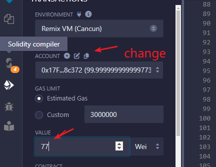

```
status	0x1 Transaction mined and execution succeed
transaction hash	0x838a3241ecc6ccc0c21c99d8d673e4d85c9a9f74d48eacc7a193b3c5f552bd42
block hash	0x717e2becf8dc797932b568a6c0c50c4eb211e983446c5cdddb77ee77bcb0c378
block number	114
from	0x17F6AD8Ef982297579C203069C1DbfFE4348c372
to	NFTSwap.purchase(address,uint256) 0x9D437a1Da98559542f1F3b457B94560c0446254A
gas	105743 gas
transaction cost	82350 gas 
execution cost	65590 gas 
input	0x8de...00000
decoded input	{
	"address _nftAddress": "0xfB72aAdB17a855D27A68B565ee0a84CB30A387e4",
	"uint256 tokenId": "0"
}
decoded output	{}
logs	[
	{
		"from": "0xfB72aAdB17a855D27A68B565ee0a84CB30A387e4",
		"topic": "0xddf252ad1be2c89b69c2b068fc378daa952ba7f163c4a11628f55a4df523b3ef",
		"event": "Transfer",
		"args": {
			"0": "0x9D437a1Da98559542f1F3b457B94560c0446254A",
			"1": "0x17F6AD8Ef982297579C203069C1DbfFE4348c372",
			"2": "0",
			"from": "0x9D437a1Da98559542f1F3b457B94560c0446254A",
			"to": "0x17F6AD8Ef982297579C203069C1DbfFE4348c372",
			"tokenId": "0"
		}
	}
]
value	77 wei
```

