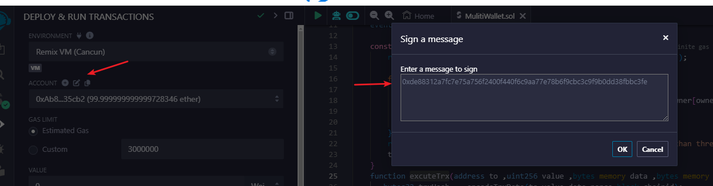

# 多签钱包

## 成员变量

**ownerList(address[]) 、isOwner(mapping(address => bool)) 、threshold(uint256) 、ownerCount(uint256)**

**nonce**(uint256 交易次数)

因为是多签钱包，所以在部署合约的时候就要传入 持有人的地址，以及多签执行门槛 ==》ownerList、threshold；

为了方便校验是否是owner 所以用isOwner来记录 不用每次都遍历ownerList；

ownerCount 是为了记录有效持有人数量，因为传入的地址有的可能不合规

```solidity
address[] public ownerList; //持有人地址
mapping(address => bool) public isOwner;//是否是持有人映射
uint256 public threshold;//多签门槛
uint256 public ownerCount; //有效持有人数量
```


## 构造函数

传参 :_owerList(address[]), _threshold(uint256);

需要校验：

1：参数持有人数组需要大于0

2：参数执行门槛需要大于等于1

3：owner地址不可等于0 或者等于合约地址 或者重复

4：有效持有人地址小于多签门槛

```solidity
constructor(address[] memory _owerList,uint256 _threshold) {
  require(threshold == 0 ,"已经初始化过");//为什么要加这个？可以多次初始化？
  require(_owerList.length > 0,"参数持有人数组需要大于0");
  require(_threshold >= 1,"参数执行门槛需要大于等于1");
  
  for(uint256 i = 0; i < _owerList.length; i++) {
      address owner = _owerList[i];
      require(owner != address(0) && owner != address(this) && !isOwner(owner),"owner地址不可等于0 或者等于合约地址 或者重复");
      ownerList.push(owner);
      isOwner[owner] = true;
  }
  require(ownerList.length >= _threshold,"有效持有人地址小于多签门槛")
  ownerCount = ownerList.length;
  threshold = _threshold；
}
```


## 执行交易

### a.参数

1.address to : 目标地址

2.uint256 value :发送的以太坊数额

3.bytes memory data ：数据data

4.bytes memory signatures : 打包签名

打包签名指的是将多个签名者对同一个交易哈希的签名，按照多签持有人地址从小到大的顺序，组合成一个字节数组（bytes）。这个过程通常用于多重签名（multisig）钱包或者多方确认的交易执行中，确保所有授权的签名者都已经对交易进行了确认。

让我们通过一个简单的例子来理解：

假设有一个多签钱包，需要三个签名者共同确认并执行一笔交易。这三个签名者的地址分别是：

1. 签名者A: 0x123...
2. 签名者B: 0x456...
3. 签名者C: 0x789...

现在有一笔交易，其哈希为 `transactionHash`。

1. **每个签名者生成签名**：
   - 签名者A 使用自己的私钥对 `transactionHash` 进行签名，生成签名 `signatureA`。
   - 签名者B 使用自己的私钥对 `transactionHash` 进行签名，生成签名 `signatureB`。
   - 签名者C 使用自己的私钥对 `transactionHash` 进行签名，生成签名 `signatureC`。
2. **按地址顺序打包签名**：
   - 现在将这些签名按照签名者的地址从小到大的顺序排列，即先是签名者A的签名，然后是签名者B的签名，最后是签名者C的签名。
3. **组合成字节数组**：
   - 将排列好的签名依次连接起来，形成一个字节数组。这个字节数组即为打包后的签名数据。

例如，假设 `signatureA`, `signatureB`, `signatureC` 分别是 65 字节的签名数据，那么打包后的字节数组将是 `bytes` 类型，长度为 195 字节（65 * 3）。

这样打包后的签名数据可以被用于执行交易，确保所有授权的签名者都已经确认了这笔交易。这种设计保证了在多签环境下，交易只有在得到所有签名者的确认后才会执行，从而增强了安全性和信任度。


### b.执行逻辑

function executeTrx(address to ,uint256 value, bytes memory data, bytes memory signatures) public payable virtual returns (bool success) {

1. 编码交易数据，计算哈希
2. 增加nonce;
3. 检查签名
4. 利用call执行交易，获取结果
5. 发送对于交易结果事件

}

**1.编码交易数据，计算哈希**

chainid : 防止重放

```solidity
function encodeTransactionData(
    address to,
    uint256 value,
    bytes memory data,
    uint256 _nonce,
    uint256 chainid
 ) public payable virtual  returns (bool success) {
   	bytes32 trxHash = keccak256(abi.encode(to,value,keccak256(data),_nonce,chainid));
   	return trxHash;
}
```

**2.增加nonce**

```
nonce++;
```

3.**检查签名**

1: 检查执行门槛大于0

2:签名足够长

3：验证签名

```solidity
function checkSignatures(bytes32 txHash,bytes memory signatures) public view {
  require(threshold > 0,"执行门槛大于0");
  require(signatures.length  >= threshold*65,"签名需要足够长");
  
  
  //
  address lastOwner = address(0); 
  address currentOwner;
  uint8 v;
  bytes32 r;
  bytes32 s;
  uint256 i;
  for (i = 0; i < _threshold; i++) {
      (v, r, s) = signatureSplit(signatures, i);
      // 利用ecrecover检查签名是否有效
      currentOwner = ecrecover(keccak256(abi.encodePacked("\x19Ethereum Signed Message:\n32", dataHash)), v, r, s);
      require(currentOwner > lastOwner && isOwner[currentOwner], "DQ5007");
      lastOwner = currentOwner;
  }
}
```

```solidity
//将单个签名从打包的签名分离出来，参数分别为打包签名 signatures 和要读取的签名位置 pos。利用了内联汇编，将签名的 r，s，和 v 三个值分离出来。
function signatureSplit(bytes memory signatures,uint256 pos)internalpurereturns (uint8 v,bytes32 r,bytes32 s) {
 // 签名的格式：{bytes32 r}{bytes32 s}{uint8 v}
    assembly {
        let signaturePos := mul(0x41, pos)
        r := mload(add(signatures, add(signaturePos, 0x20)))
        s := mload(add(signatures, add(signaturePos, 0x40)))
        v := and(mload(add(signatures, add(signaturePos, 0x41))), 0xff)
    }
}

这段代码是 Solidity 中使用 Assembly 语言编写的一段代码片段，用于从一组签名中解析出其中一个签名的 r、s 和 v 值。让我们逐步解释每一部分的含义和作用：

整体结构：

这段代码使用了 Solidity 的 assembly 关键字，表示接下来的代码将是原生的 EVM 汇编语言代码，而不是 Solidity 的高级语法。
变量定义：

signaturePos 是一个临时变量，用来计算当前签名在 signatures 内存数组中的位置。pos 是一个整数变量，表示当前处理的签名在数组中的索引位置。
内存加载指令：

mload 指令用于从内存中加载数据。在这段代码中，mload(add(signatures, add(signaturePos, 0x20))) 加载了从 signatures 数组中计算得到的偏移位置开始的 32 字节数据，存入 r 变量中。
同样地，mload(add(signatures, add(signaturePos, 0x40))) 和 mload(add(signatures, add(signaturePos, 0x41))) 分别加载了 s 和 v 值。
位运算：

v := and(mload(add(signatures, add(signaturePos, 0x41))), 0xff) 这行代码使用了 and 位运算符，将加载的 v 值与 0xff 进行按位与操作，从而获取 v 值的低八位（即取 v 的最后一个字节）。
解释
signaturePos := mul(0x41, pos)：计算当前签名在 signatures 数组中的偏移量。这里 0x41 是固定的偏移量，因为每个签名通常包括 r、s 和 v 三部分，每部分各占 32 字节（即 0x20 字节），加上 v 值的一个字节（即 0x01 字节）。
r := mload(add(signatures, add(signaturePos, 0x20)))：加载从 signatures 数组中 signaturePos + 0x20 开始的 32 字节数据，存入 r 变量。
s := mload(add(signatures, add(signaturePos, 0x40)))：加载从 signatures 数组中 signaturePos + 0x40 开始的 32 字节数据，存入 s 变量。
v := and(mload(add(signatures, add(signaturePos, 0x41))), 0xff)：加载从 signatures 数组中 signaturePos + 0x41 开始的 1 字节数据，并仅保留最后一个字节，存入 v 变量。
```

**4.利用call执行交易，获取结果**

```solidity
 (success, ) = to.call{value: value}(data);
```

**5.发送对于交易结果事件**

```solidity
//事件
event ExecutionSuccess(bytes32 txHash);    // 交易成功事件
event ExecutionFailure(bytes32 txHash);    // 交易失败事件
```

```solidity
//发送事件
 if (success) emit ExecutionSuccess(txHash);
 else emit ExecutionFailure(txHash);
```


示例代码

```solidity
pragma solidity ^0.8.24;
// SPDX-License-Identifier: UNLICENSED

contract MultiWallet {
    address[] private ownerList;
    uint256 private threshold;
    mapping(address => bool) private isOwner;
    uint256 private nonce;
    uint256 private ownerCount;

    event TrxSuccess(bytes32 trxhash);
    event TrxFail(bytes32 trxhash);

    constructor(address[] memory _ownerList, uint256 _threshold) {
        require(_ownerList.length > 0 && _threshold >= 1, "invalid params");
        
        for(uint256 i = 0 ;i < _ownerList.length; i++){
            address owner = _ownerList[i];
            require(owner != address(0) && owner != address(this) && !isOwner[owner],"owner can not be 0 or contract address or duplicate");
            ownerList.push(owner);
        }
        require(ownerList.length >= _threshold ,"valide owner count less than threshold");
        threshold = _threshold;
    }
    function excuteTrx(address to ,uint256 value ,bytes memory data ,bytes memory signatures) public   payable  virtual returns (bool success) {
       bytes32 trxHash =  encodeTrxData(to,value,data,nonce,block.chainid);
       nonce++;
       checkSignatures(trxHash,signatures);
       (success, ) = to.call{value: value}(data);
       if(success){
           emit TrxSuccess(trxHash);
       }else {
           emit TrxFail(trxHash);
       }
    }

    function encodeTrxData(address to ,uint256 value ,bytes memory data ,uint256 _nonce,uint256 chainid) public   pure returns (bytes32 hash){
        return keccak256(abi.encode(to,value,keccak256(data),_nonce,chainid));
    }

    function checkSignatures(bytes32 hash,bytes memory signatures) private view  {
        require(threshold >= 1,"threshold must greater than 1");
        require(signatures.length >= threshold * 65,"signatures invalid");

        address  lastOwner = address(0);
        address currentOwner;
        uint8 v;
        bytes32 r;
        bytes32 s;
        for(uint256 i = 0;i < threshold ; i++){
            (v, r, s) = signatureSplit(signatures, i);
              // 利用ecrecover检查签名是否有效
            currentOwner = ecrecover(keccak256(abi.encodePacked("\x19Ethereum Signed Message:\n32", hash)), v, r, s);
            require(currentOwner != lastOwner && isOwner[currentOwner],"signatures invalid");
            lastOwner = currentOwner;
        }
    }

    function signatureSplit(bytes memory signatures,uint256 pos) private pure returns(uint8 v,bytes32 r,bytes32 s) {
      assembly {
        let signaturePos := mul(0x41, pos)
        r := mload(add(signatures, add(signaturePos, 0x20)))
        s := mload(add(signatures, add(signaturePos, 0x40)))
        v := and(mload(add(signatures, add(signaturePos, 0x41))), 0xff)
      }

  }
}
```


部署参数

```
_OWNERLIST： ["0xAb8483F64d9C6d1EcF9b849Ae677dD3315835cb2", "0x5B38Da6a701c568545dCfcB03FcB875f56beddC4"]
_THRESHOLD ：2
```


调用encodeTrxData

```
to :0x78731D3Ca6b7E34aC0F824c42a7cC18A495cabaB
value:111111
data:0x
nonce:0
chanid:1

hash:0xde88312a7fc7e75a756f2400f440f6c9aa77e78b6f9cbc3c9f9b0dd38fbbc3fe
```


获得签名

```
0xAb8483F64d9C6d1EcF9b849Ae677dD3315835cb2
HASH
0x4095aa214186bedfa1e03f5ecaf91091d9a2f8ab9216ea1fa5d825742964ad94
SIGNATURE
0x3a93a9d28e303455fa0e8a0b80a4d9b2dbcd8b878988c92b0e1e31e72e99aab524816b4d77a38df90d29b93d6a9937fd1adef63d6397754c18a609fad67a64e01c

0x5B38Da6a701c568545dCfcB03FcB875f56beddC4
HASH
0x4095aa214186bedfa1e03f5ecaf91091d9a2f8ab9216ea1fa5d825742964ad94
SIGNATURE
0xec8f867121e2ec1007cd72a19b2bc676089b72d126b4d590115094751e145d5657b89a8a7df8f72aa1d4cf801efc9d439dadc4a107fae01c0d50fd62c832f4de1c
```

打包签名

```
0x3a93a9d28e303455fa0e8a0b80a4d9b2dbcd8b878988c92b0e1e31e72e99aab524816b4d77a38df90d29b93d6a9937fd1adef63d6397754c18a609fad67a64e01cec8f867121e2ec1007cd72a19b2bc676089b72d126b4d590115094751e145d5657b89a8a7df8f72aa1d4cf801efc9d439dadc4a107fae01c0d50fd62c832f4de1c
```

调用excuteTrx()

```
to :0x78731D3Ca6b7E34aC0F824c42a7cC18A495cabaB
value : 111111
data :0x
signaturs : 0x3a93a9d28e303455fa0e8a0b80a4d9b2dbcd8b878988c92b0e1e31e72e99aab524816b4d77a38df90d29b93d6a9937fd1adef63d6397754c18a609fad67a64e01cec8f867121e2ec1007cd72a19b2bc676089b72d126b4d590115094751e145d5657b89a8a7df8f72aa1d4cf801efc9d439dadc4a107fae01c0d50fd62c832f4de1c
```


**总结** ： 

1：部署参数里面的account 用的是 remix里面 预留的account不是随便给的


2：调用excuteTrx方法传入的签名 需要是每个账号对该笔交易的签名

所以需要 将这笔交易的hash拿出来 用对于的账号生成一个签名

所以需要先调用encodeTrxData

 

再去拿签名




3：最终调用 excuteTrx方法的时候 ，目标地址跟value都需要跟调用 encodeTrxData 的值一样 不然就不是同一笔交易