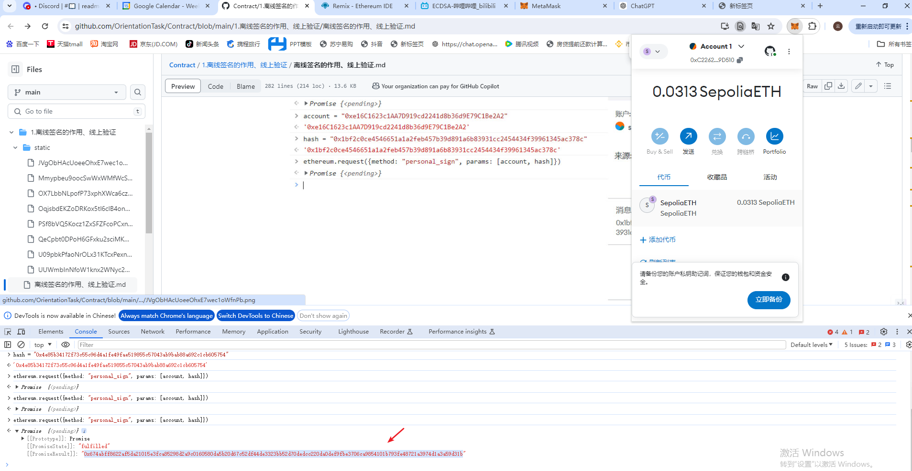
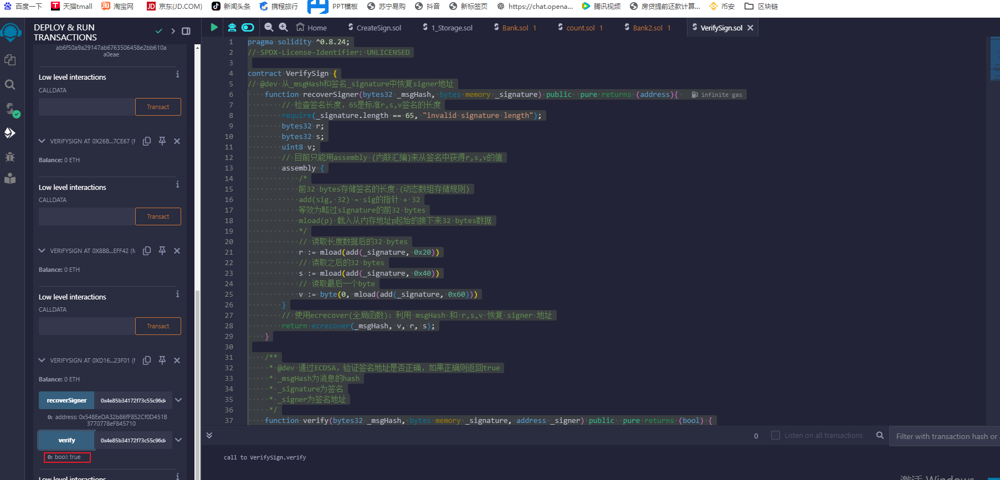

# 离线签名

```
my_account : 0xC2262e23D357bf77F5089b0A6793058BeDA9D510

```

```
pragma solidity ^0.8.24;

// SPDX-License-Identifier: UNLICENSED
contract CreateSign {
    /*
     * 将mint地址（address类型）和tokenId（uint256类型）拼成消息msgHash
     * _account: 0x5B38Da6a701c568545dCfcB03FcB875f56beddC4
     * _tokenId: 0
     */
    function getMessageHash(address _account, uint256 _tokenId) public pure returns(bytes32){
        return keccak256(abi.encodePacked(_account, _tokenId));
    }

    /**
     * 返回 以太坊签名消息
     * `hash`：消息
     * 遵从以太坊签名标准：https://eth.wiki/json-rpc/API#eth_sign[`eth_sign`]
     * 以及`EIP191`:https://eips.ethereum.org/EIPS/eip-191`
     * 添加"\x19Ethereum Signed Message:\n32"字段，防止签名的是可执行交易。
     */
    function toEthSignedMessageHash(bytes32 hash) public pure returns (bytes32) {
        // 哈希的长度为32
        return keccak256(abi.encodePacked("\x19Ethereum Signed Message:\n32", hash));
    }
}
```


生成的：

```
getMessageHash ： 0x4e85b34172f73c55c96d4a1fe49fae519855c57043ab9bab88a692c1cb605754
toEthSignedMessageHash ： 0x7b753ddfc673119d02bec7365ab6f50a9a29147ab6763506458e2bb610aa0eae
```




```
消息： 0x4e85b34172f73c55c96d4a1fe49fae519855c57043ab9bab88a692c1cb605754
签名 ：0x674abff8622af5da21015e3fca85298d2a9c0160580da5b20d67c52df44de3323bb52d70dedcc220da0def9fbe3706ca9854101b793fe48721a3974d1a3a59d31b
```


## 验证签名

```
pragma solidity ^0.8.24;
// SPDX-License-Identifier: UNLICENSED

contract VerifySign {
// @dev 从_msgHash和签名_signature中恢复signer地址
    function recoverSigner(bytes32 _msgHash, bytes memory _signature) public  pure returns (address){
        // 检查签名长度，65是标准r,s,v签名的长度
        require(_signature.length == 65, "invalid signature length");
        bytes32 r;
        bytes32 s;
        uint8 v;
        // 目前只能用assembly (内联汇编)来从签名中获得r,s,v的值
        assembly {
            /*
            前32 bytes存储签名的长度 (动态数组存储规则)
            add(sig, 32) = sig的指针 + 32
            等效为略过signature的前32 bytes
            mload(p) 载入从内存地址p起始的接下来32 bytes数据
            */
            // 读取长度数据后的32 bytes
            r := mload(add(_signature, 0x20))
            // 读取之后的32 bytes
            s := mload(add(_signature, 0x40))
            // 读取最后一个byte
            v := byte(0, mload(add(_signature, 0x60)))
        }
        // 使用ecrecover(全局函数)：利用 msgHash 和 r,s,v 恢复 signer 地址
        return ecrecover(_msgHash, v, r, s);
    }

    /**
     * @dev 通过ECDSA，验证签名地址是否正确，如果正确则返回true
     * _msgHash为消息的hash
     * _signature为签名
     * _signer为签名地址
     */
    function verify(bytes32 _msgHash, bytes memory _signature, address _signer) public  pure returns (bool) {
        return recoverSigner(_msgHash, _signature) == _signer;
    }
    
    

}
```




### remix验证

```
// SPDX-License-Identifier: MIT
pragma solidity ^0.8.0;

// 从 OpenZeppelin 导入 ERC721 合约
import "@openzeppelin/contracts/token/ERC721/ERC721.sol";
import "@openzeppelin/contracts/utils/cryptography/ECDSA.sol";

contract SignatureNFT is ERC721 {
    address immutable public signer; // 签名地址
    mapping(address => bool) public mintedAddress;   // 记录已经mint的地址

    // 构造函数，初始化NFT合集的名称、代号、签名地址
    constructor(string memory _name, string memory _symbol, address _signer)
    ERC721(_name, _symbol)
    {
        signer = _signer;
    }

    // 利用ECDSA验证签名并mint
    function mint(address _account, uint256 _tokenId, bytes memory _signature) external
    {
        bytes32 _msgHash = getMessageHash(_account, _tokenId); // 将_account和_tokenId打包消息
        bytes32 _ethSignedMessageHash = toEthSignedMessageHash(_msgHash); // 计算以太坊签名消息
        require(verify(_ethSignedMessageHash, _signature,_account), "Invalid signature"); // ECDSA检验通过
        require(!mintedAddress[_account], "Already minted!"); // 地址没有mint过
        _mint(_account, _tokenId); // mint
        mintedAddress[_account] = true; // 记录mint过的地址
    }

    /*
     * 将mint地址（address类型）和tokenId（uint256类型）拼成消息msgHash
     * _account: 0xC2262e23D357bf77F5089b0A6793058BeDA9D510
     * _tokenId: 0
     * 对应的消息: 0x4e85b34172f73c55c96d4a1fe49fae519855c57043ab9bab88a692c1cb605754
     */
    function getMessageHash(address _account, uint256 _tokenId) public pure returns(bytes32){
        return keccak256(abi.encodePacked(_account, _tokenId));
    }

    /**
 * @dev Returns an Ethereum Signed Message, created from a `hash`. This
 * produces hash corresponding to the one signed with the
 * `eth_sign` JSON-RPC method as part of EIP-191.
 *
 * See {recover}.
 */
function toEthSignedMessageHash(bytes32 hash) internal pure returns (bytes32) {
    // 32 is the length in bytes of hash,
    // enforced by the type signature above
    return keccak256(abi.encodePacked("\x19Ethereum Signed Message:\n32", hash));
}

// @dev 从_msgHash和签名_signature中恢复signer地址
    function recoverSigner(bytes32 _msgHash, bytes memory _signature) public  pure returns (address){
        // 检查签名长度，65是标准r,s,v签名的长度
        require(_signature.length == 65, "invalid signature length");
        bytes32 r;
        bytes32 s;
        uint8 v;
        // 目前只能用assembly (内联汇编)来从签名中获得r,s,v的值
        assembly {
            /*
            前32 bytes存储签名的长度 (动态数组存储规则)
            add(sig, 32) = sig的指针 + 32
            等效为略过signature的前32 bytes
            mload(p) 载入从内存地址p起始的接下来32 bytes数据
            */
            // 读取长度数据后的32 bytes
            r := mload(add(_signature, 0x20))
            // 读取之后的32 bytes
            s := mload(add(_signature, 0x40))
            // 读取最后一个byte
            v := byte(0, mload(add(_signature, 0x60)))
        }
        // 使用ecrecover(全局函数)：利用 msgHash 和 r,s,v 恢复 signer 地址
        return ecrecover(_msgHash, v, r, s);
    }

    /**
     * @dev 通过ECDSA，验证签名地址是否正确，如果正确则返回true
     * _msgHash为消息的hash
     * _signature为签名
     * _signer为签名地址
     */
    function verify(bytes32 _msgHash, bytes memory _signature, address _signer) public  pure returns (bool) {
        return recoverSigner(_msgHash, _signature) == _signer;
    }

}
```

**部署参数**

```
_name: RCC Signature
_symbol: RCC
_signer: 0xC2262e23D357bf77F5089b0A6793058BeDA9D510
```

调用mint()

```
_account: 0xC2262e23D357bf77F5089b0A6793058BeDA9D510
_tokenId: 0
_signature: 0x674abff8622af5da21015e3fca85298d2a9c0160580da5b20d67c52df44de3323bb52d70dedcc220da0def9fbe3706ca9854101b793fe48721a3974d1a3a59d31b
```


调用ownerOf()

​	

```
_tokenId: 0
```


总结：

所以 

签名 是由 account 和msgHash (abi.encodePacked(_account, _tokenId))  在电子钱包生成的，

验证签名 用msgHash 与签名 通过函数取出_account，跟输入的做比对，看是否一致