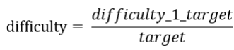
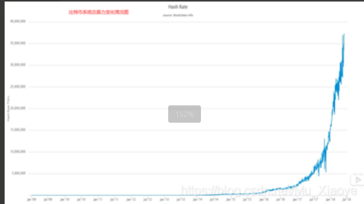
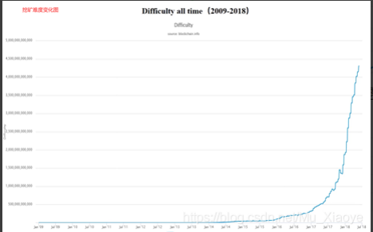
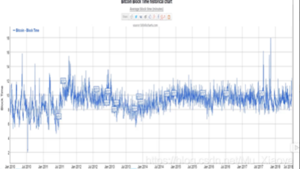

# 6-比特币挖矿难度调整

之前有提到过，在比特币系统中，区块链的出块时间保持在平均10min左右。毫无疑问的是，伴随着参与挖矿的人增多，系统总算力不断增强，挖矿的难度绝对不能一成不变。实际上，在比特币系统开发过程中，中本聪便考虑到了这个问题，并设计了一个相应的难度调整算法。这一篇，便了解一下比特币系统中的挖矿难度调整算法。

## 为什么要调整挖矿难度

之前已经提过，挖矿本质上就是不断调整block header中的nonce值，使整个block header的哈希值小于等于给定的目标阈值。即：H(block header)<=target.（target便是目标阈值，target越小，目标难度就越大）对于挖矿难度的调整，可以视为调整目标空间在整个输出空间中所占比例大小。

之前有提及，比特币系统采用的哈希算法为SHA-256，所以整个输出空间大小为2^256，调整目标空间所占比例，简单的说需要目标值前需要多少个0。 当然，挖矿难度和目标阈值成反比，如下图所示，其中difficulty_1_target为是挖矿难度为1时候的target，即最小挖矿难度

1. **如果不调整挖矿难度会怎么样？** 

   系统总算力越来越强，若挖矿难度保持不变，则出块时间会越来越短。

2. **出块时间越来越短是好事吗？**

    出块时间缩短，那么交易可以很快便被写入区块链，并且提高了系统响应时间，

   增加了区块链系统效率。但是，出块时间并不是越短越好。出块时间太短，也会造成一定的问题。首先，区块

   在网络上传播具有时延，假如出块时间为1秒，但网络传播需要10秒，则会使得系统中节点经常性处于不一致的

   状态，增加了系统不稳定性，且系统经常性位于分叉状态（不仅二分叉，乃至多分叉）。分叉过多，则不利于

   系统达成共识，且会造成算力分散，使得黑客攻击成本大大降低(不再需要整个系统51%的算力)。

3. **10 min 的出块间隔是最优吗？**

   当然不是，但可以确定的是，系统出块时间需要维持在一个定值附近。后续文章

   中会介绍以太坊，以太坊中平均出块时间仅为15秒左右，但同样在以太坊中也有相应难度调整算法维持其平均

   出块时间(后续会写文介绍)，当然15s的时间明显会产生经常性的分叉，所以以太坊设计了新的共识协议

   Ghost（后续文章中会介绍）。 当然，对于一个交易系统来说，10min这样一个交易时间是比较长的。但对于

   跨国交易来说，这个时间反而大大缩短了交易时间，减少了相应成本。

## BTC 系统如何调整挖矿难度

在BTC协议中规定，每隔2016个区块需要调整一次难度，根据10min产生一个新区块可以得到，大概需要14天的时

间。具体调整公式如下：

可见，如果实际实际比较长，target会比较大，相应的挖矿难度会降低；如果实际实际比较短，target会比较小，相应的挖矿难度会增大。

**当然**，上调和下调都是有**4倍的限制**。例如：实际最近2016个区块出块时间超过8个星期(正常2个星期)，计算也只按照8个星期计算；实际最近2016个区块出块时间小于0.5个个星期(正常2个星期)，计算也只按照0.5个星期计算.这样是为了防止网络中出现黑天鹅事件。

**如何让所有矿工都愿意调整这个挖矿难度呢？**

 这一调整算法在代码中已经写入，如果有恶意节点故意不调，其所产生的区块不会被大多数诚实的节点承认。 在block header中有一个nbits的域，它是对target的编码存储（target为256位，nbits为32位，也就是说block header并未直接存储target），其他节点在进行合法性验证时候会验证nbits域是否合法，不合法则对该区块不予以承认。

**思考：比特币出现之后也曾经涌现出一大堆数字货币，为什么偏偏比特币存活了下来？** 

很大程度上是由于比特币设计本身注重鲁棒性（（英语：Robustness）是指一个系统、模型、算法或过程在面对不确定性、变化或干扰时保持其功能和性能的能力。）而非高效，使得系统的健壮性极高。可见实际工业应用，不应该一味追逐新技术的应用，实际上来说，哪一种能更好解决我们的实际问题就用哪种。像区块链技术火起来之后的**炒币**浪潮，其中又有多少是披着区块链皮的项目呢？更别说火极一时的区块链养狗，养猫之类的项目，实际上根本不需要用上区块链技术！

## 其他

1. 比特币系统总算力变化情况图 需要注意的是，之前一段并非直线，而是之后增长太猛导致之前增长趋势看上去太低。

   

   2. 挖矿难度变化图 可以看到，和系统算力变化情况基本同步（符合难度调整预期目标）

      

**思考：挖矿难度变低是好事吗？** 

对于矿工来说，挖矿难度变低，挖矿变得更容易，这也说明大多数人对该币种不再看好，这个币种的价值也会大跳水，这对矿工来说可是一个坏消息。

3. 2010-2018每天出块时间图 可见基本维持在10min左右上下波动，达到预期设计目标

