## 8-比特币脚本篇

## 交易实例：

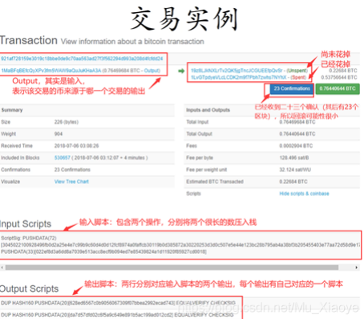

比特币系统中使用的脚本语言非常简单，唯一可以访问的内存空间只有栈，所以也被称为“基于栈的语言”

交易的宏观信息：

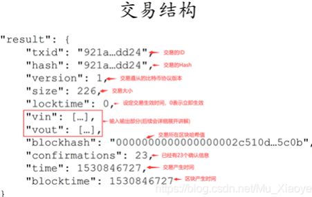

Vin的内容：

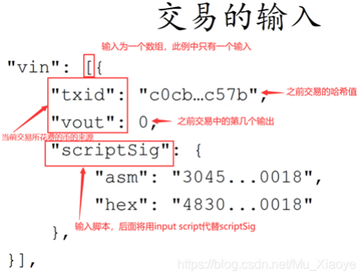

如果存在 一个交易有多个输入，那么每个输入都要说明币的来源并给出签名（BTC中一个交易可能需要多个签名）

Vout的内容：

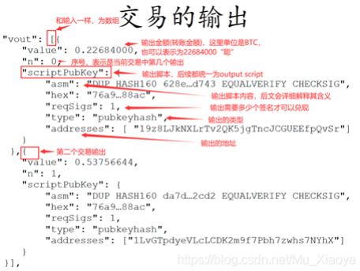

## 输入输出脚本的执行

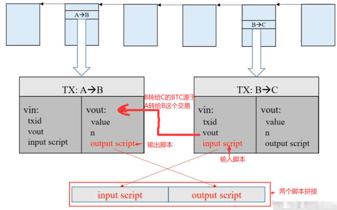

如图所示，为脚本执行流程。在早期，直接将两个脚本按照如图顺序(input script在前，output script在后) 拼接后执行，后来考虑到安全性问题，两个脚本改为分别执行：先执行input script，若无出错，再执行output script。 如果脚本可以顺利执行，最终栈顶结果为true，则验证通过，交易合法；如果执行过程中出现任何错误，则交易非法。如果一个交易有多个输入脚本，则每个输入脚本都要和对应的输出脚本匹配执行，全部验证通过才能说明该交易合法。

## 输入输出脚本的几种形式

**P2PK形式(Pay to public key)**

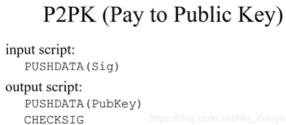

执行过程(将两个脚本拼接起来)：

注：实际执行已经不再拼接两个脚本

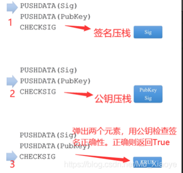

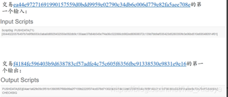

**P2PKH形式(Pay to public key hash)——最常用**

特点：输出脚本不直接给出收款人公钥，而是公钥的哈希。

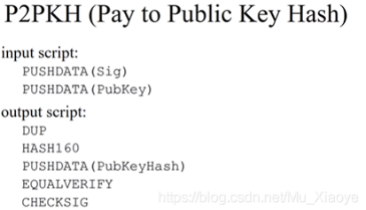

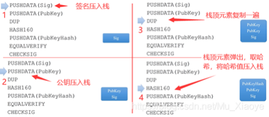

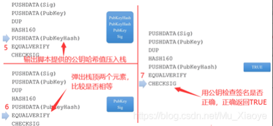

说明： 1.图中第5步，两个公钥哈希是不同的。上面一个是输出脚本提供的收款人的哈希，下面一个是要花钱时候输入脚本要给出的公钥通过HASH160操作得到的。 2..图中第6步，该操作的目的是为了防止冒名顶替(公钥)。假设比较正确，则两个元素消失（不往栈中压入TRUE或FALSE）

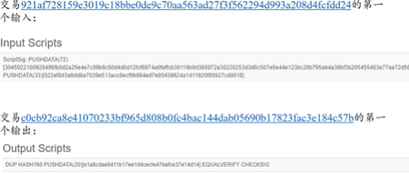

## P2SH形式(Pay to script hash)

特点：输出脚本给出的不是收款人公钥的哈希，而是收款人提供的一个脚本的哈希。该脚本称为redeemScript,即赎回脚本。等未来花钱的时候，输入脚本要给出redeemScript的具体内容以及可以使之正确运行需要的签名。

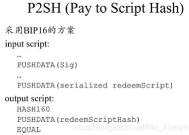

验证过程： 1.验证序列化的redeemScript是否与output script中哈希值匹配。 2.反序列化并执行redeemScript，验证iutput script中给出签名是否正确。（将赎回脚本内容当作操作指令执行一遍） redeemScript的形式： 1.P2PK形式 2.P2PKH形式 3.多重签名形式

实例：

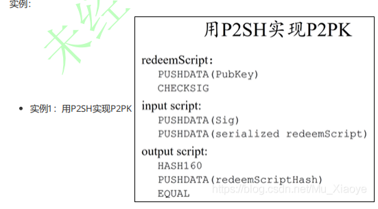

运行过程：

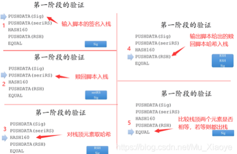

第一阶段执行拼接后的输入和输出脚本。 第二阶段执行反序列化后的赎回脚本（反序列化操作并未展现，因为其是每个节点需要自己执行的）

**为什么要弄这么复杂？用之前介绍的P2PK不就可以了吗？为什么要将这部分功能嵌入到赎回脚本？** 

​     毫无疑问，针对这个例子，这样做确实复杂了。实际上P2SH在BTC系统中起初并没有，后来通过软分叉(后续会有一篇文章专门介绍硬分叉和软分叉)加入了这个功能。实际上，该功能的常见应用场景是对多重签名的支持。 在BTC系统中，一个输出可能需要多个签名才能取出钱来。例如，对于公司账户，可能会要求5个合伙人中任意3个的签名才能取走钱，这样便为私钥泄露和丢失提供了一定程度的保护。**多重签名** 下为最早的多重签名实现方法： 该方法通过CHECKMULTISIG来实现，其中输入脚本提供N个签名，输出脚本给出N个公钥和阈值M，表示N个人至少有M个签名即可实现转账(N>=M)。输入脚本只需要提供N个公钥中M个合法签名即可。【给出的M个签名顺序要和N个公钥中相对顺序一致】输出脚本最前面有一个红色的X，是因为比特币中CHECKMULTISIG的实现存在一个bug，执行时会从堆栈上多弹出一个元素。这个bug现在已经无法修改(去中心化系统中软件升级代价极大，需要硬分叉修改)。所以，实际中采用的方案是往栈中多压入一个无用元素。

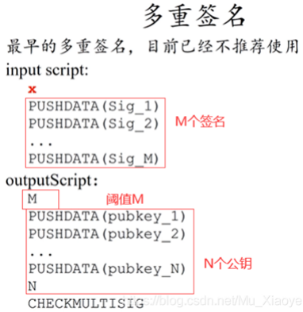

执行实例： 如图为一个N=3，M=2的多重签名脚本执行过程。其中前三行为输入脚本内容，后续为输出脚本内容。 

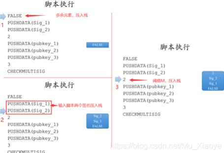

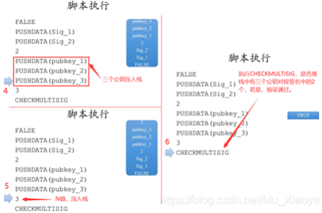

早期的实际应用中，多重签名就是这样写的。但是，在应用中体现出了一些问题。例如，在网上购物时候，某个电商使用多重签名，要求5个合伙人中任意3个人才能将钱取出。这就要求用户在生成，转账交易时候，要给出五个合伙人的转账公钥以及N个M的值。而对于用户来说，需要购物网站公布出来才能知道这些信息。不同电商对于数量要求不一致，会为用户转账交易带来不便之处(因为这些复杂性全暴露给了用户)。 为了解决这一问题，就需要用到**P2SH**

如图为使用P2SH实现多重签名

本质上是将复杂度从输出脚本转移到输入脚本，可见此时输出脚本只有三行，原本复杂度被转入到赎回脚本redeemScript中。输出脚本只需要给出赎回脚本的哈希值即可。该赎回脚本在输入脚本提供，即收款人提供。这样做，类似之前提到的电商，收款人只需要公布赎回脚本哈希值即可，用户只要在输出脚本中包含该哈希值，用户无需知道收款人的相关规则(对用户更加友好)。

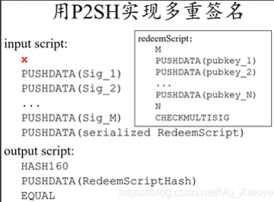

**第一阶段验证（输入输出脚本）：**

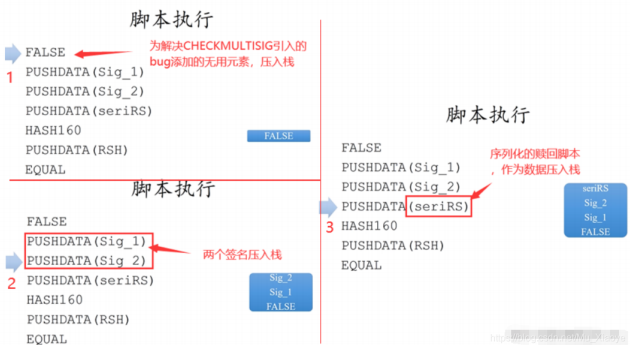

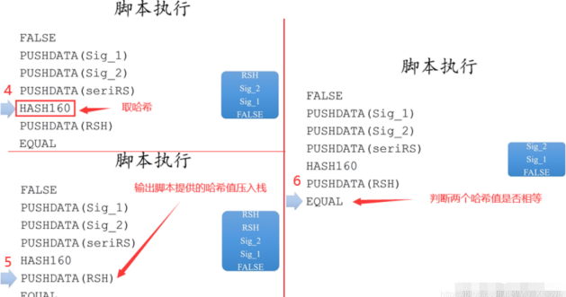

**第二阶段验证（赎回脚本）：**

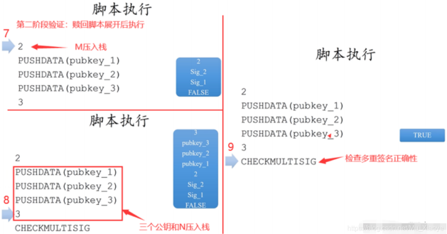

实例：

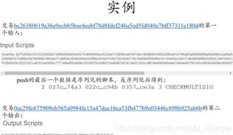

现在的多重签名，大多都采用P2SH的形式

**一个特殊的脚本**

以RETURN开始，后面可以跟任何内容。 RETURN操作，无条件返回错误，所以该脚本永远不可能通过验证。执行到RETURN，后续操作不会再执行。 该方法是销毁比特币的一种方法。

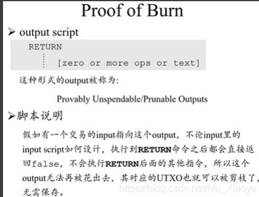

**Q：为什么要销毁比特币？？？**

现在比特币价值极高，销毁是不是很可惜？ 1.部分小币种(AltCoin)要求销毁部分比特币才能得到该种小币种。例如，销毁一个BTC可以得到1000个小币。即，使用这种方法证明付出了一定代价，才能得到小币种。 2.往区块链中写入内容。我们经常说，区块链是不可篡改的账本，有人便利用该特性往其中添加想要永久保存的内容。例如：股票预测情况的哈希、知识产权保护——知识产权的哈希值（防止篡改）。

有没有觉得第二个应用场景有些熟悉？实际上，之前谈到BTC发行的唯一方法，便是通过铸币交易凭空产生（数据结构篇中）。在铸币交易中，有一个CoinBase域，其中便可以写入任何内容。那么为什么不使用这种方法呢，而且这种方法不需要销毁BTC，可以直接写入

因为这种方法只有获得记账权的节点才可以写入内容。而上面的方法，可以保证任何一个BTC系统中节点乃至于单纯的用户，都可以向区块链上写入想写入的内容。【**发布交易不需要有记账权，发布区块需要有记账权**】任何用户都可以使用这种方法，通过销毁很小一部分比特币，换取向区块链中写入数据的机会。实际上，很多交易并未销毁BTC，而是支付了交易费。 例如下图为一个铸币交易，其中包含两个交易，第二个交易便是仅仅想要往其中写入内容。

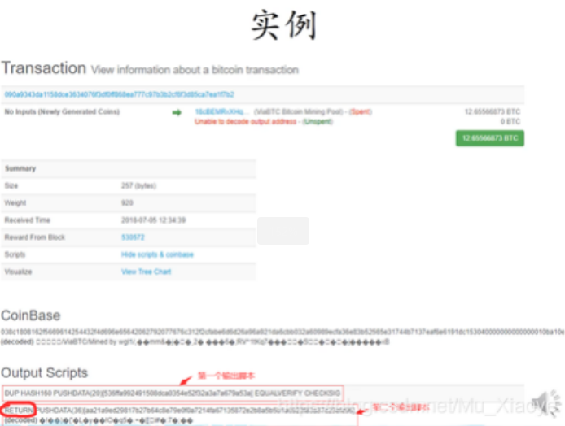

为一个普通的转账交易，其就是仅仅为了向区块链写入内容。该交易并未销毁BTC，只是将输入的费用作为交易费给了挖到矿的矿工。 这种交易永远不会兑现，所以矿工不会将其保存在UTXO中，对全节点比较友好。

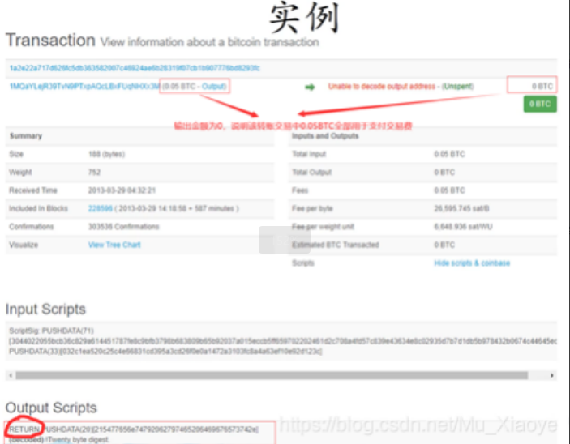

**实际中的脚本，都需要加上OP前缀，如：CHECKSIG应该为OP_CHECKSIG,这里仅仅为了学习友好，就删去了该前缀**

## 总结

BTC系统中使用的脚本语言非常简单，简单到没有一个专门的名称，我们就称其为”比特币脚本语言“。而在后文的以太坊的智能合约中，则比此复杂得多。实际上，该脚本语言甚至连一般语言中的循环都不支持，但设计简单却也有其用意。 如果不支持循环，也就永远不会出现死循环，也就不用担心停机问题。而在以太坊中，由于其语言图灵完备，所以要依赖于**汽油费**机制来防止其陷入死循环。此外，该脚本语言虽然在某些方面功能很有限，但另外一些方面功能却很强大(密码学相关功能很强大，可能中本聪本人擅长于密码学？？？) 例如，前文提到的CHECKMULTISIG用一条语句便实现了检查多重签名的功能。这一点与很多通用编程语言相比，是很强大的。