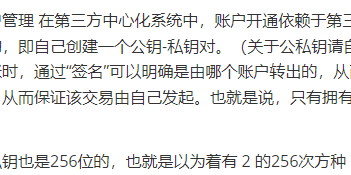

# 区块链原理、

## 比特币

比特币,以太币都属于加密货币，可见其中必然会涉及到密码学的知识。而比特币本身开放，其交易记录、交易金额、交易内容

甚至源代码都面向全网开放，加密又使用在哪里呢？在比特币中，正是加密确保了信息的不可篡改，保证了区块链本

身的优势——不可篡改。

在比特币系统中，加密主要涉及两个内容：hash，签名

## 1. hash （哈希）

hash 就是 其实就是一个函数H(x)，给定参数会得到一个 固定位数的值。

其中有两个比较重要的性质 collision resistance (对哈希碰撞有抗拒性) 和 hiding(隐藏性)

### 1.1 collision resistance (对哈希碰撞有抗拒性)

给定一个hash函数 H(x)，和x，y；x != y，但是有 H(x) = H(y) ,那么 这个就是哈希碰撞。

collision resistance 就是说 给定的这个hash函数G(x) ,和x，y ;如果有 G(x) = G(y) 那么 x 就等于y（理想情况下）。

这个理想情况下 是指，x !=y的可能性很小。比如比特币中用的SHA-256哈希算法，无论你输入多大的文本 都会输出一个 256位的哈希值

**当 n=240n = 2^{40}n=240（大约一万亿个哈希值）：**

所以 我们认为 SHA-256哈希算法 是不会 发生哈希碰撞的，意思就是 不可能有 x != y，但是有 H(x) = H(y)。

### 1.2 hiding(隐藏性)

给定一个hash函数 H(x) ,和一个值，很容易得到一个哈希值y，但是 我们不能从 哈希值y，H(x) 倒推出x。

因为上面说过 无论多大的文本 都会生成一个固定长度的哈希值，这个过程当中肯定有数据缺失的，不然hash函数就是一个超级无敌压缩算法，

我们可以将所有的书都压缩成一个固定长度的哈希值，到我们需要的时候再反推出来，当然这个是不可能的，所以就可以很好的 hide(隐藏) **原来的值**。

在加密货币的系统中，还有一个很重要的性质就是

### 1.3 Puzzle friendly 

某些数据结构或算法可能被称为 “puzzle friendly”，因为它们的特性使它们易于被用于解决特定类型的谜题

该性质要求哈希值计算事先不可预测，

仅仅根据输入很难预测出输出。例如：我们需要一个哈希值，存在于某一个范围内，只能通过不停运算查找出来

因为你输入什么根本不知道会输出什么值，所以只能一个一个试。

所谓**挖矿**就是 找这个输入值的过程，给定一个范围比如 H(x) < t，通过不停的试探找到x值的过程，就跟去大山里面挖矿一样 找到就可以有钱赚（比特币的挖矿奖励）。

## 2.签名

比特币中账户管理 在第三方中心化系统中，账户开通依赖于第三方。但去中心化的比特币系统中，很明显不能进行“申请账户”。在比特币系统中，申请账户是用户自己来处理的，即自己创建一个公钥-私钥对。（关于公私钥请自行了解非对称加密体系和对称加密体系） 公钥和私钥的应用保证了“签名”的应用。当在比特币网络中进行转账时，通过“签名”可以明确是由哪个账户转出的，从而防止不良分子对其他账户比特币的盗取。 在发布交易时，通过自己私钥签名，其他人可以根据公钥进行验证，从而保证该交易由自己发起。也就是说，只有拥有私钥，才能将该账户中的比特币转走。 【注意：比特币系统中，很难通过生成大量公私钥对来获取他人私钥】

因为生成的私钥也是256位的，也就是以为着有 2 的256次方种 ，这个数量远远超过了地球上所有原子的数量。

